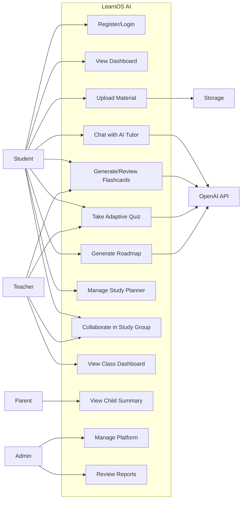

# Use Case Diagram

```mermaid
flowchart LR
  Student["Student"]
  Teacher["Teacher"]
  Parent["Parent"]
  Admin["Admin"]
  AI["OpenAI API"]
  Storage["Storage"]

  subgraph Platform["LearnOS AI"]
    Register["Register/Login"]
    Dashboard["View Dashboard"]
    Upload["Upload Material"]
    Flashcard["Generate/Review Flashcards"]
    Quiz["Take Adaptive Quiz"]
    Tutor["Chat with AI Tutor"]
    Roadmap["Generate Roadmap"]
    Planner["Manage Study Planner"]
    Group["Collaborate in Study Group"]
    TeacherDash["View Class Dashboard"]
    ParentDash["View Child Summary"]
    AdminDash["Manage Platform"]
    Reports["Review Reports"]
  end

  Student --> Register
  Student --> Dashboard
  Student --> Upload
  Student --> Flashcard
  Student --> Quiz
  Student --> Tutor
  Student --> Roadmap
  Student --> Planner
  Student --> Group

  Teacher --> TeacherDash
  Teacher --> Group
  Teacher --> Quiz
  Teacher --> Flashcard

  Parent --> ParentDash
  Admin --> AdminDash
  Admin --> Reports

  Upload --> Storage
  Tutor --> AI
  Flashcard --> AI
  Quiz --> AI
  Roadmap --> AI
```

