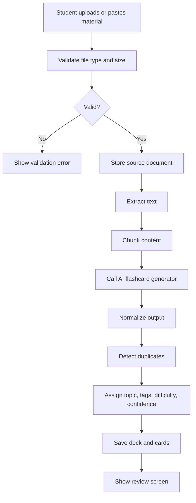
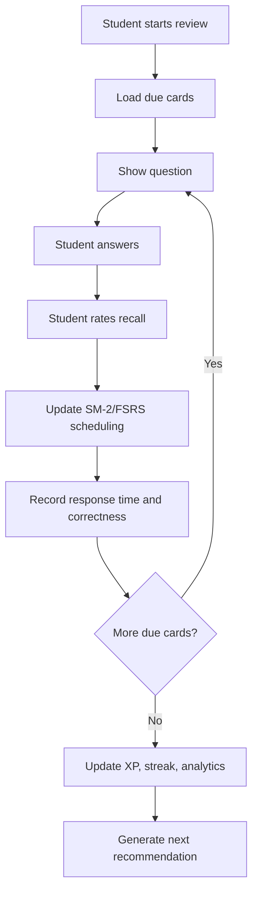

# Activity Diagram

## AI Flashcard Generation Flow

```mermaid
flowchart TD
  A["Student uploads or pastes material"] --> B["Validate file type and size"]
  B --> C{"Valid?"}
  C -- No --> D["Show validation error"]
  C -- Yes --> E["Store source document"]
  E --> F["Extract text"]
  F --> G["Chunk content"]
  G --> H["Call AI flashcard generator"]
  H --> I["Normalize output"]
  I --> J["Detect duplicates"]
  J --> K["Assign topic, tags, difficulty, confidence"]
  K --> L["Save deck and cards"]
  L --> M["Show review screen"]
```

## Adaptive Review Flow

```mermaid
flowchart TD
  A["Student starts review"] --> B["Load due cards"]
  B --> C["Show question"]
  C --> D["Student answers"]
  D --> E["Student rates recall"]
  E --> F["Update SM-2/FSRS scheduling"]
  F --> G["Record response time and correctness"]
  G --> H{"More due cards?"}
  H -- Yes --> C
  H -- No --> I["Update XP, streak, analytics"]
  I --> J["Generate next recommendation"]
```

