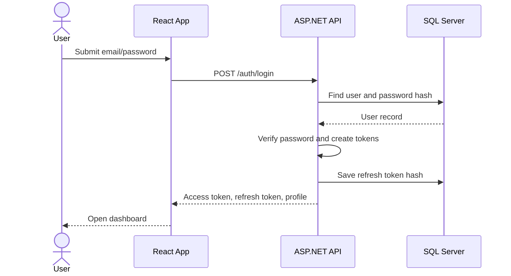
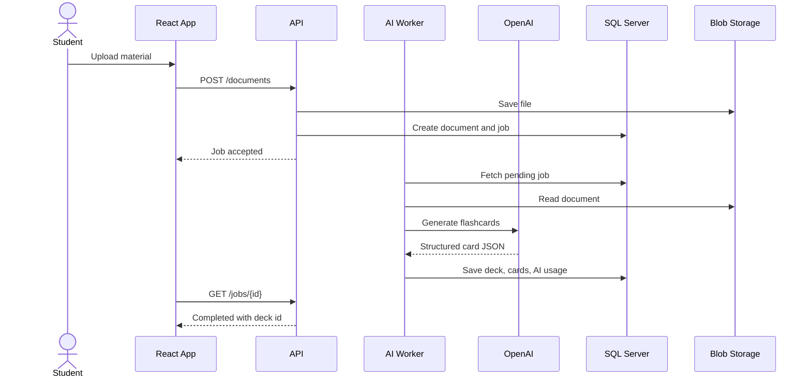
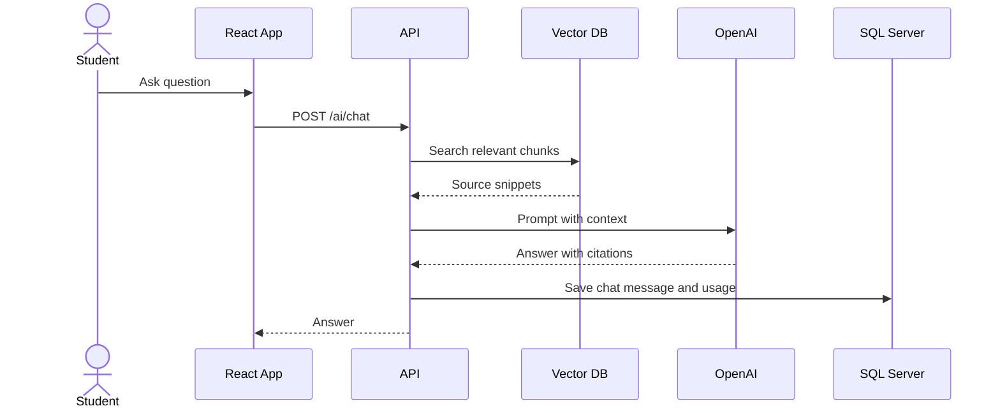

# Sequence Diagrams

## Login

```mermaid
sequenceDiagram
  actor User
  participant FE as React App
  participant API as ASP.NET API
  participant DB as SQL Server

  User->>FE: Submit email/password
  FE->>API: POST /auth/login
  API->>DB: Find user and password hash
  DB-->>API: User record
  API->>API: Verify password and create tokens
  API->>DB: Save refresh token hash
  API-->>FE: Access token, refresh token, profile
  FE-->>User: Open dashboard
```

## Generate Flashcards

```mermaid
sequenceDiagram
  actor Student
  participant FE as React App
  participant API as API
  participant Worker as AI Worker
  participant AI as OpenAI
  participant DB as SQL Server
  participant Storage as Blob Storage

  Student->>FE: Upload material
  FE->>API: POST /documents
  API->>Storage: Save file
  API->>DB: Create document and job
  API-->>FE: Job accepted
  Worker->>DB: Fetch pending job
  Worker->>Storage: Read document
  Worker->>AI: Generate flashcards
  AI-->>Worker: Structured card JSON
  Worker->>DB: Save deck, cards, AI usage
  FE->>API: GET /jobs/{id}
  API-->>FE: Completed with deck id
```

## AI Tutor with RAG

```mermaid
sequenceDiagram
  actor Student
  participant FE as React App
  participant API as API
  participant Vector as Vector DB
  participant AI as OpenAI
  participant DB as SQL Server

  Student->>FE: Ask question
  FE->>API: POST /ai/chat
  API->>Vector: Search relevant chunks
  Vector-->>API: Source snippets
  API->>AI: Prompt with context
  AI-->>API: Answer with citations
  API->>DB: Save chat message and usage
  API-->>FE: Answer
```

