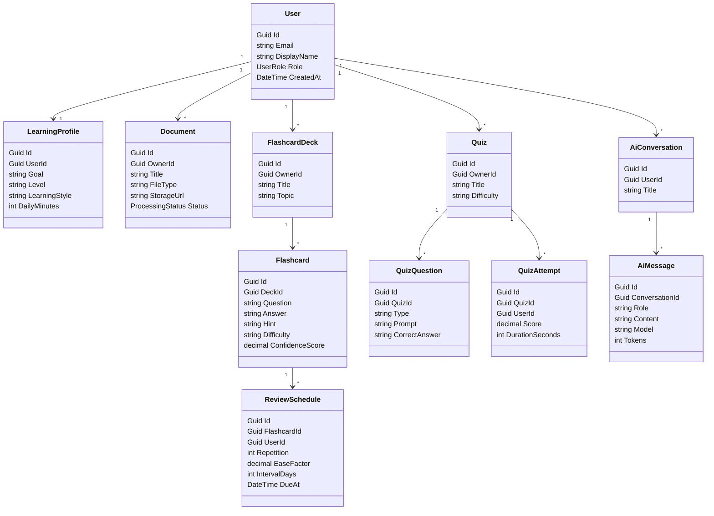

# Class Diagram

```mermaid
classDiagram
  class User {
    Guid Id
    string Email
    string DisplayName
    UserRole Role
    DateTime CreatedAt
  }

  class LearningProfile {
    Guid Id
    Guid UserId
    string Goal
    string Level
    string LearningStyle
    int DailyMinutes
  }

  class Document {
    Guid Id
    Guid OwnerId
    string Title
    string FileType
    string StorageUrl
    ProcessingStatus Status
  }

  class FlashcardDeck {
    Guid Id
    Guid OwnerId
    string Title
    string Topic
  }

  class Flashcard {
    Guid Id
    Guid DeckId
    string Question
    string Answer
    string Hint
    string Difficulty
    decimal ConfidenceScore
  }

  class ReviewSchedule {
    Guid Id
    Guid FlashcardId
    Guid UserId
    int Repetition
    decimal EaseFactor
    int IntervalDays
    DateTime DueAt
  }

  class Quiz {
    Guid Id
    Guid OwnerId
    string Title
    string Difficulty
  }

  class QuizQuestion {
    Guid Id
    Guid QuizId
    string Type
    string Prompt
    string CorrectAnswer
  }

  class QuizAttempt {
    Guid Id
    Guid QuizId
    Guid UserId
    decimal Score
    int DurationSeconds
  }

  class AiConversation {
    Guid Id
    Guid UserId
    string Title
  }

  class AiMessage {
    Guid Id
    Guid ConversationId
    string Role
    string Content
    string Model
    int Tokens
  }

  User "1" --> "1" LearningProfile
  User "1" --> "*" Document
  User "1" --> "*" FlashcardDeck
  FlashcardDeck "1" --> "*" Flashcard
  Flashcard "1" --> "*" ReviewSchedule
  User "1" --> "*" Quiz
  Quiz "1" --> "*" QuizQuestion
  Quiz "1" --> "*" QuizAttempt
  User "1" --> "*" AiConversation
  AiConversation "1" --> "*" AiMessage
```

