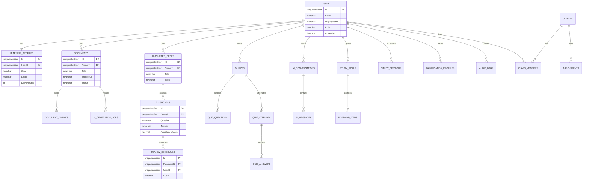

# ERD

```mermaid
erDiagram
  USERS ||--|| LEARNING_PROFILES : has
  USERS ||--o{ DOCUMENTS : owns
  USERS ||--o{ FLASHCARD_DECKS : owns
  FLASHCARD_DECKS ||--o{ FLASHCARDS : contains
  FLASHCARDS ||--o{ REVIEW_SCHEDULES : schedules
  DOCUMENTS ||--o{ DOCUMENT_CHUNKS : splits
  DOCUMENTS ||--o{ AI_GENERATION_JOBS : triggers
  USERS ||--o{ QUIZZES : owns
  QUIZZES ||--o{ QUIZ_QUESTIONS : contains
  QUIZZES ||--o{ QUIZ_ATTEMPTS : attempted
  QUIZ_ATTEMPTS ||--o{ QUIZ_ANSWERS : records
  USERS ||--o{ AI_CONVERSATIONS : starts
  AI_CONVERSATIONS ||--o{ AI_MESSAGES : contains
  USERS ||--o{ STUDY_GOALS : creates
  STUDY_GOALS ||--o{ ROADMAP_ITEMS : contains
  USERS ||--o{ STUDY_SESSIONS : schedules
  USERS ||--o{ GAMIFICATION_PROFILES : earns
  USERS ||--o{ AUDIT_LOGS : causes
  CLASSES ||--o{ CLASS_MEMBERS : has
  USERS ||--o{ CLASS_MEMBERS : joins
  CLASSES ||--o{ ASSIGNMENTS : owns

  USERS {
    uniqueidentifier Id PK
    nvarchar Email
    nvarchar DisplayName
    nvarchar Role
    datetime2 CreatedAt
  }
  LEARNING_PROFILES {
    uniqueidentifier Id PK
    uniqueidentifier UserId FK
    nvarchar Goal
    nvarchar Level
    int DailyMinutes
  }
  DOCUMENTS {
    uniqueidentifier Id PK
    uniqueidentifier OwnerId FK
    nvarchar Title
    nvarchar StorageUrl
    nvarchar Status
  }
  FLASHCARD_DECKS {
    uniqueidentifier Id PK
    uniqueidentifier OwnerId FK
    nvarchar Title
    nvarchar Topic
  }
  FLASHCARDS {
    uniqueidentifier Id PK
    uniqueidentifier DeckId FK
    nvarchar Question
    nvarchar Answer
    decimal ConfidenceScore
  }
  REVIEW_SCHEDULES {
    uniqueidentifier Id PK
    uniqueidentifier FlashcardId FK
    uniqueidentifier UserId FK
    datetime2 DueAt
  }
```

