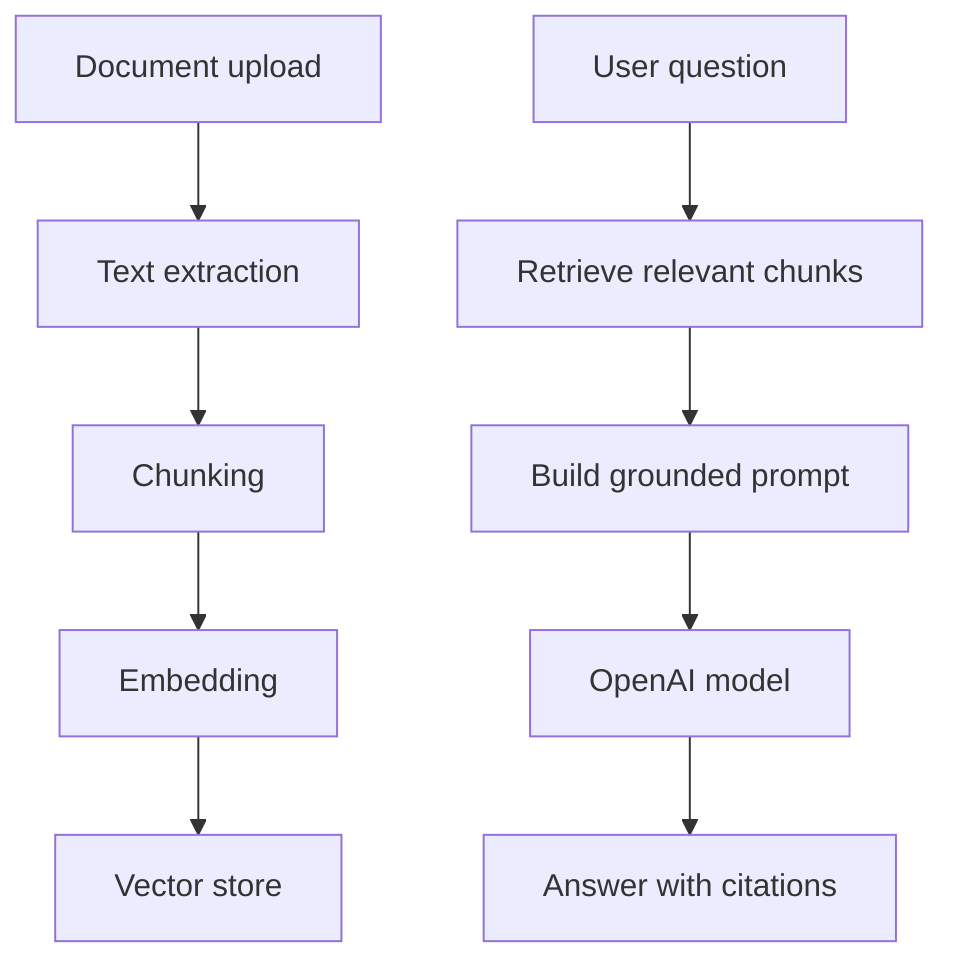

# AI Architecture

## 1. AI Capabilities

- Flashcard generation
- Quiz generation
- Tutor chat
- Summarization
- Explanation
- Roadmap generation
- Recommendation
- Motivation detection
- Future RAG over user documents

## 2. AI Service Boundary

The backend should expose AI through internal application services, not direct frontend calls. This protects API keys, allows rate limits, enables logging, and makes model changes easier.

## 3. RAG Pipeline

## 4. Prompt Types

| Prompt | Output |
|---|---|
| Flashcard generator | JSON array of cards |
| Quiz generator | JSON quiz with questions/options/answers |
| Tutor | conversational answer with optional citations |
| Roadmap | weekly plan with milestones |
| Recommendation | next best action |
| Motivation | risk level and intervention |

## 5. Guardrails

- Require structured JSON schema for generation.
- Validate and repair AI output.
- Store prompt version.
- Include confidence score.
- Keep source references where available.
- Avoid medical, legal, or unsafe advice without disclaimers.

## 6. AI Usage Tracking

Store:

- User ID
- Feature
- Model
- Prompt tokens
- Completion tokens
- Estimated cost
- Latency
- Success/failure

## 7. Model Strategy

- Fast model for lightweight explanation and classification.
- Stronger model for document generation, hard reasoning, and roadmap.
- Embedding model for document search.
- Cache repeated generations by source hash and prompt version.

